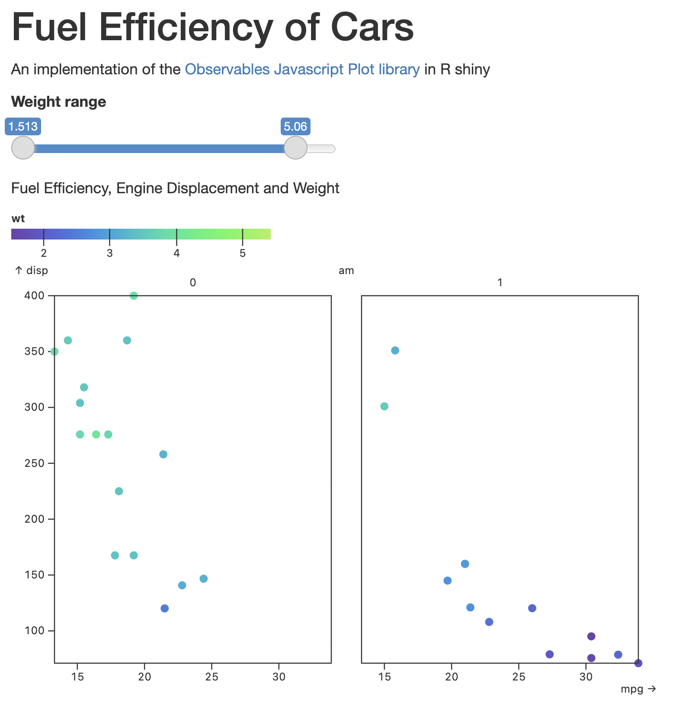

# Observable Plot

[Observable Plot](https://observablehq.com/plot) is a new Javascript plot function library.  Observable Plot is similar to GGPLOT in using the grammar of graphics syntax for constructing plots through building layers (which in observable are called `marks`).  

Observable plots are already available in {ojs} blocks in [Quarto](https://quarto.org/docs/interactive/ojs/). 

This repository includes functions which facilitate using the Observable plot library in R shiny apps, using R shiny inputs and data objects. 

Examples of using the Observable and the functions provided are available in the Examples folder. The second uses the 
`mtcars` dataset to illustrate reactive elements. 



# Installation 

Install the latest version from github:

```
devtools::install_github("kletts/ObservablePlotR")
```

In the shiny app, in the app header include the following script src statements, these will import the libraries 
for Observable when the app is started. 

```
fluidPage(
    htmltools::HTML('<script src="https://cdn.jsdelivr.net/npm/d3@7"></script>'), 
    htmltools::HTML('<script src="https://cdn.jsdelivr.net/npm/@observablehq/plot@0.6"></script>'),
    ...
```

# Usage

Observable plots are called in shiny using the  `uiOutput` `renderUI` function pairs. In the UI, include the plot output: 

```
ui <- fluidPage(
  htmltools::HTML('<script src="https://cdn.jsdelivr.net/npm/d3@7"></script>'), 
  htmltools::HTML('<script src="https://cdn.jsdelivr.net/npm/@observablehq/plot@0.6"></script>'),
  uiOutput("myplot") 
  )
```

In the server: 

```
server <- function(input, output) { 
  output$myplot <- renderUI({ 
    ObservablePlotR::obsjs_plot(inputId="myplot", 
      ObservablePlotR::obsjs_mark(
        mark="barY", 
        data=data.frame(x=letters[1:5], y=1:5), 
        options=list(x="x", y="y")))
    })
    }
```


